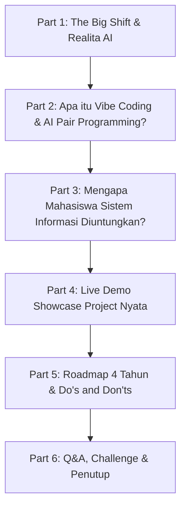

# DRAFT MATERI & SLIDE PRESENTASI SEMINAR AI & VIBE CODING
**Prodi Sistem Informasi — UIN Alauddin Makassar (UINAM)**
*Target Audiens: Mahasiswa Baru (Semester 1)*

---

## 🎯 1. JUDUL & SUBJUDUL SEMINAR TERPILIH

Berdasarkan keseluruhan materi—mulai dari mengubah rasa minder menjadi *superpower*, analogi kalkulator, pentingnya fundamental SDLC, hingga keunggulan *domain knowledge* anak Sistem Informasi—berikut adalah judul final yang paling kuat dan merangkum seluruh esensi acara:

> **"AI Bukan Pengganti, Tapi Senjata Utama: Mencetak Tech Builder di Era Vibe Coding"**
> *Subtitle: Blueprint Mengubah Ide Menjadi Produk Nyata.*

---

## 👥 2. ANALISIS AUDIENS & GOAL SEMINAR

* **Karakter Audiens (Maba Semester 1 SI):**
  * Masih dalam fase transisi dari SMA/SMK ke perkuliahan.
  * Sebagian besar belum paham sintaks pemrograman dasar, sebagian khawatir "apakah jurusan ini susah/harus jago matematika dan coding?".
  * Terpapar AI (ChatGPT, Claude, Gemini) tapi umumnya baru sebatas buat tugas esai/tanya jawab, belum tahu cara memanfaatkannya untuk *engineering* produk.
* **Goal Utama:**
  1. Menghilangkan ketakutan dan stigma bahwa "coding itu momok yang menakutkan".
  2. Membuka wawasan bahwa mahasiswa **Sistem Informasi** memiliki peran strategis (kombinasi *logic, business process, user experience*, dan *teknologi*).
  3. Memperkenalkan era baru **Vibe Coding & AI Agents** dengan etika dan pemahaman konsep yang benar.
  4. Memberi inspirasi lewat **demo nyata project yang sudah dibuat** (menunjukkan bahwa membuat aplikasi fungsional sekarang jauh lebih cepat dan terjangkau).

---

## 📊 3. STRUKTUR SLIDE POWERPOINT (SLIDE-BY-SLIDE DRAFT)

---

### **BAGIAN 1: OPENING & THE BIG SHIFT (10 Menit)**

#### **Slide 1: Cover / Judul Utama**
* **Headline:** AI Bukan Pengganti, Tapi Senjata Utama: Mencetak Tech Builder di Era Vibe Coding
* **Sub-headline:** Blueprint Mengubah Ide Menjadi Produk Nyata.
* **Visual:** Desain modern dark mode dengan aksen visual neon/neural node + nama pemateri & institusi.

#### **Slide 2: Ice Breaking & Polling Singkat**
* **Pertanyaan ke audiens:**
  1. *"Siapa di sini yang masuk SI karena penasaran bikin aplikasi/web?"*
  2. *"Siapa yang merasa takut coding / belum pernah ngoding sama sekali?"*
  3. *"Siapa yang tiap hari sudah pakai ChatGPT / Gemini buat bantu tugas?"*
* **Key Takeaway:** Kalian masuk ke dunia teknologi di **waktu paling tepat dalam sejarah manusia**.

#### **Slide 3: Realita Baru Dunia Software (Then vs Now)**
* **Dulu (Traditional Way):**
  * Harus hafal sintaks, kurung kurawal, titik koma, dan konfigurasi environment rumit berhari-hari.
  * Butuh berbulan-bulan hanya untuk membuat halaman login dan CRUD sederhana.
* **Sekarang (AI-Assisted Era):**
  * Bahasa manusia (Natural Language) menjadi bahasa pemrograman baru (*English/Indonesian is the new hot programming language* - Andrej Karpathy).
  * Fokus bergeser dari sekadar *"mengetik kode"* ke *"arsitektur solusi, alur logika, dan value produk"*.

#### **Slide 4: Takut Tergantikan AI? (Mengatasi Rasa Minder & *Imposter Syndrome*)**
* **Kekhawatiran Umum:** Banyak maba IT merasa minder melihat AI bisa menulis kode aplikasi kompleks dalam hitungan detik. *"Lalu saya kuliah 4 tahun buat apa kalau semua sudah bisa dikerjakan mesin?"*
* **Cara Menghandle & Mengubah Sudut Pandang:**
  1. **AI adalah Co-Pilot, Bukan Pilot:** Secanggih apapun AI, ia tidak tahu *"masalah apa yang paling mendesak untuk dipecahkan masyarakat"*. Ia butuh *Director* yang punya empati, ide, dan pemahaman lapangan.
  2. **Yang Tergantikan Bukanlah Programmer, melainkan "Coder Hafalan":** Pekerjaan yang hilang adalah orang yang hanya bertugas copy-paste sintaks. Pekerjaan yang akan sangat mahal adalah *Problem Solver* yang bisa mengorkestrasi AI untuk membangun sistem bisnis nyata.
  3. **Jadikan Leverage, Bukan Ancaman:** Anggap AI sebagai asisten magang yang jenius tapi buta arah. Tugas kalian di prodi Sistem Informasi adalah belajar menjadi **manajer/arsitek** untuk asisten tersebut.
  4. **Mitos Menghafal Sintaks:** Menghafal sintaks coding di era AI itu ibarat koki bintang lima yang mencoba menghafal takaran ratusan resep. AI adalah "Buku Resep"-nya. Yang membedakan koki hebat dan koki amatir adalah kemampuan "Mencicipi Rasa" (Mengerti *Logic* & *Problem Solving*). Fokuslah melatih nalar, biarkan AI yang mengingat sintaks.
  5. **Analogi Kalkulator & Matematika:** Kehadiran AI mempercepat eksekusi, bukan menghilangkan profesi. Sama ibaratnya saat kalkulator pertama kali ditemukan; orang-orang pesimis untuk belajar matematika dan perhitungan karena merasa *"sudah digantikan kalkulator"*. Faktanya, kalkulator tidak memusnahkan ahli matematika/insinyur, justru memungkinkan mereka membangun hal yang lebih kompleks dan lebih cepat.

---

### **BAGIAN 2: MENGENAL VIBE CODING & CARA KERJA AI MODERN (15 Menit)**

#### **Slide 5: Apa Sebenarnya "Vibe Coding"?**
* **Definisi:** Pendekatan pengembangan software di mana developer/builder bertindak sebagai **Director / Architect**, sementara AI Agent (Claude, Gemini, Cursor, Antigravity) bertindak sebagai **Junior Engineer & Co-Pilot**.
* **Analogi Sutradara vs Kameramen:** AI ibarat kameramen jenius dengan fokus dan *lighting* sempurna (sintaks kode). Tapi sehebat apapun kameramen, film tidak akan jadi jika tidak ada **Sutradara** yang menentukan jalan cerita. Mahasiswa SI adalah sang Sutradara!
* **Analogi Iron Man vs J.A.R.V.I.S:** Vibe coding mirip Tony Stark dan Jarvis. Jarvis (AI) yang melakukan komputasi dan simulasi kode. Tapi **Tony Stark (Anda) yang punya visi**, yang merancang arah, dan bertanggung jawab atas hasil akhirnya. AI butuh visi manusia untuk bisa menghasilkan produk hebat.
* **Analogi Exoskeleton (Baju Zirah Robot):** AI ibarat *exoskeleton* yang memampukan Anda mengangkat beban 100 kg. Namun, jika manusia yang memakainya tidak punya keseimbangan atau logika dasar, baju itu akan ambruk ke depan. Jangan gunakan AI sebagai "tongkat" penyangga kemalasan, gunakan AI sebagai *exoskeleton* untuk memecahkan masalah besar.
* **3 Pilar Vibe Coding:**
  1. **Clear Context & Prompting (Awas *Garbage In, Garbage Out*):** Jika perintah (prompt) Anda abstrak dan tidak jelas (*Garbage In*), maka AI akan memberikan kode yang tampak rapi tapi salah secara logika (*Garbage Out*). Orang yang gajinya paling mahal nanti adalah yang **paling pintar menjelaskan masalah**.
  2. **Iterative Feedback:** Membaca error, menguji fungsionalitas, dan meminta AI memperbaiki bagian tertentu.
  3. **Verification & Domain Knowledge:** Memahami arsitektur data dan alur sistem agar tidak "halusinasi".

#### **Slide 6: "Jebakan" Vibe Coding & Kenapa Fundamental Harga Mati**
* **The Illusion of Competence (Ilusi Kemampuan):** Hanya karena AI bisa membuat aplikasi penuh dalam hitungan menit, bukan berarti Anda benar-benar mengerti cara kerjanya.
* **Artificial Intelligence vs Natural Stupidity:** Sehebat apapun *Kecerdasan Buatan* yang kalian pakai, ia tidak akan bisa menyelamatkan kalian dari *Kebodohan Alami*. Menerima hasil AI 100% tanpa verifikasi dan mematikan nalar kritis adalah sebuah kebodohan. AI hanya mengamplifikasi apa yang sudah ada di dalam kepala Anda.
* **Mengapa Menyerahkan 100% pada AI adalah Kesalahan Besar?**
  1. **Debugging Mimpi Buruk:** AI terkadang berhalusinasi atau mencampuradukkan versi kode lama dan baru. Jika Anda tidak tahu fundamental (algoritma, tipe data, dll), Anda akan menghabiskan waktu berjam-jam untuk *error* kecil.
  2. **Security & Performance:** AI sering menulis kode yang berjalan cepat tapi rentan diretas (*SQL Injection*, dll). Fundamental basis data & jaringan dibutuhkan untuk mengaudit keamanannya.
  3. **Arsitektur Skala Besar:** AI sangat pintar membuat fitur individual, tapi belum bisa merancang arsitektur aplikasi skala *Enterprise* untuk jutaan pengguna. Manusia tetap yang menyatukan *puzzle*-nya.
  4. **Beyond Coding (DevOps, QA, CI/CD):** Membuat kode berjalan di laptop itu mudah. Tapi memastikannya bebas *bug* untuk *user* nyata (QA), di-*deploy* ke *cloud server* dengan aman (DevOps), dan bisa *update* otomatis tanpa *server* mati (CI/CD) membutuhkan pemahaman *Software Engineering* riil yang tak bisa sekadar di-generate.
  5. **Etika Profesi & Tanggung Jawab Hukum:** Jika Anda membuat sistem Rumah Sakit pakai AI, lalu AI berhalusinasi membuat database pasien tertukar sehingga salah obat... yang dituntut dan dipenjara bukanlah ChatGPT, melainkan **Anda sebagai developernya**. AI adalah alat, tapi integritas moral dan tanggung jawab mutlak milik manusia!

#### **Slide 7: Ekosistem AI Coding Tools 2026**
* **Kategori Tools:**
  * **AI Chat / Brainstorming:** Gemini 3.x, Claude Sonnet, ChatGPT.
  * **AI Code Editor & Agents:** Cursor, VS Code + Roo Code/Cline, Google Antigravity IDE.
  * **Web/App Generators:** v0.dev, Bolt.new, Lovable.
  * **Deployment Instan:** Vercel, Firebase, Supabase, Cloudflare.

---

### **BAGIAN 3: KENAPA MAHASISWA SISTEM INFORMASI SANGAT DIUNTUNGKAN? (10 Menit)**

#### **Slide 8: DNA Mahasiswa Sistem Informasi vs Teknik Informatika**
* **Perbedaan Utama:**
  * *Teknik Informatika:* Fokus mendalam pada algoritma tingkat rendah, matematika komputasi, dan optimasi hardware/mesin.
  * *Sistem Informasi:* Fokus pada **solusi bisnis, manajemen data, proses organisasi, UI/UX, dan implementasi sistem nyata untuk manusia**.
* **Poin Kunci:** Di era AI, sintaks kode bisa digenerate oleh AI, tetapi **memahami kebutuhan user, proses bisnis, dan validitas data** adalah keahlian utama anak Sistem Informasi!
* **Mentalitas "Tukang Jahit" (The Integrator):** Dulu programmer dibayar mahal untuk bikin 'roda' dari nol. Hari ini, anak SI dibayar untuk menjadi 'Tukang Jahit' jenius. Kalian tidak perlu bikin AI sendiri dari nol; tugas kalian adalah merangkai layanan A (AI), B (Database), dan C (Frontend) menjadi satu baju (solusi) yang pas dipakai oleh masyarakat. Nilai kalian ada pada *kemampuan merakit*.
* **The IT / SI Advantage (Siapa yang paling maksimal memakai AI?):** Seseorang hanya bisa memandu AI sebatas *background* ilmunya. Orang marketing akan memakai AI untuk strategi *marketing*, bukan untuk *Software Development*. Maka, orang dengan *background* IT/SI-lah yang akan memiliki hasil *coding* paling maksimal, paling aman, dan berskala besar karena kalian memiliki *Domain Knowledge*-nya!

---

### **BAGIAN 4: SHOWCASE & LIVE DEMO PROJECT (20 Menit)**
*(Menampilkan portofolio project nyata dari `~/Projects` untuk membakar semangat maba)*

#### **Slide 9: Portfolio Showcase Overview**
* Menampilkan snapshot project-project yang sudah dibuat:
  1. **KawanSedarah / KawanRawat:** Aplikasi sosial kemanusiaan (donor darah & layanan rawat).
  2. **GetKasir / GetLaundry:** Solusi digitalisasi UMKM (Point of Sale & Operasional Usaha).
  3. **DataSulsel / PPID / Layanan Publik:** Dashboard transparansi informasi & tata kelola data pemerintahan.
  4. **Asisten Virtual / Bot AI:** Otomasi alur kerja berbasis agen cerdas.

#### **Slide 10 & Sesi Live Demo: "Membedah 1 Project dari 0 ke Live"**
* **Skenario Demo Interaktif (Rekomendasi Waktu: 15 Menit):**
  * **Langkah 1 (Brainstorming & Sketsa):** Minta audiens melempar 1 ide masalah (misal: "Aplikasi pencatat stok UKM"). Gambarkan sketsa kasar antarmuka (UI) di papan tulis atau kertas, lalu foto secara langsung!
  * **Langkah 2 (Multimodal di Google AI Studio):** Buka **Google AI Studio**. Masukkan foto sketsa tadi beserta *System Instruction* yang tegas di depan mereka: *"Kamu adalah Tech Architect jenius. Ubah sketsa visual ini menjadi kode UI yang rapi dan buatkan rancangan tabel Database-nya."* Tunjukkan betapa cepat model memahami konteks visual.
  * **Langkah 3 (Menangkap *Error* & Iterasi):** Secara sengaja buat agar logika atau tampilannya belum sempurna. Tunjukkan *skill* Anda memberikan instruksi perbaikan (contoh: *"Struktur database-nya kurang kolom Harga, dan tolong tambahkan konfirmasi pada tombol Hapus agar aman"*).
  * **Langkah 4 (The Magic Moment - Live Test):** Jalankan kodenya (di browser/IDE) dan biarkan audiens melihat sketsa papan tulis mereka hidup menjadi produk nyata!
* **Pesan Utama Demo:** *"Project ini bukan dibuat dari sihir, tapi dari kolaborasi logika manusia + kecepatan eksekusi AI."*

---

### **BAGIAN 5: ROADMAP & MINDSET MAHASISWA SI DI ERA AI (15 Menit)**

#### **Slide 11: Do's and Don'ts Belajar dengan AI di Kampus**
| ✅ DO (Gunakan AI Seperti Ini) | ❌ DON'T (Hindari Kebiasaan Ini) |
| :--- | :--- |
| Minta AI menjelaskan *mengapa* baris kode tertentu error | Copy-paste kode tugas tanpa mengerti alur logikanya |
| Gunakan AI untuk eksplorasi alternatif arsitektur/database | Menyerahkan 100% pembuatan tugas kuliah tanpa membaca kembali |
| Manfaatkan AI untuk **Project-Based Learning** (Membangun project langsung sambil bertanya jika *error*) | Terjebak **"Tutorial Hell"** (Menonton tutorial berjam-jam tanpa mempraktekkan *coding* sama sekali) |
| Pelajari fundamental (struktur data, HTTP, Database Relasional) | Merasa tidak perlu belajar dasar karena "sudah ada AI" |
| Bangun portfolio nyata sejak semester awal | Menunggu sampai semester 7 / skripsi baru mulai bikin project |
| Gunakan AI untuk **mempercepat**, bukan untuk berhenti berpikir | Membiarkan "otot logika" tumpul karena disuapi jawaban instan (AI ibarat steroid) |
| Merakit *prompt* sendiri karena memahami anatomi masalah sistem | Menjadi **"Prompt Monkey"** (Hanya sekadar *copas prompt* panjang dari internet tanpa tahu kenapa prompt itu bekerja) |

#### **Slide 12: Roadmap 4 Tahun Mahasiswa Baru Sistem Informasi**
* **Tahun 1 (Semester 1 - 2) — *Foundation & Curiosity*:**
  * Pahami logika dasar pemrograman, algoritma dasar, dan struktur basis data (SQL).
  * **Harga Mati: Biasakan Bahasa Inggris.** 90% data latih AI berbahasa Inggris. *Prompting* dalam bahasa Inggris akan selalu menghasilkan logika kode yang jauh lebih akurat dan terhindar dari halusinasi.
  * Biasakan eksplorasi tools AI untuk mempercepat pemahaman materi kuliah.
* **Tahun 2 (Semester 3 - 4) — *Product Building & Web Systems*:**
  * Mulai buat aplikasi full-stack mini (Frontend + Backend + Database).
  * Pelajari Git/GitHub dan deployment online.
* **Tahun 3 (Semester 5 - 6) — *Real-World Impact & Specialization*:**
  * Magang, ikut lomba (Hackathon/Gemastik/PKM), bangun solusi untuk UMKM atau instansi sekitar.
  * Mulai kuasai *Software Development Life Cycle* (SDLC) tingkat lanjut: DevOps, CI/CD Pipelines, QA Testing, dan Cloud Deployment.
  * Dalami spesialisasi: *Data Analyst, System Analyst, AI/Product Engineer, Cloud/DevOps Engineer, UI/UX Architect*.
* **Tahun 4 (Semester 7 - 8) — *Captsone & Launch Career*:**
  * Skripsi berbasis produk/sistem nyata yang teruji digunakan user.
  * Portofolio GitHub & LinkedIn yang solid siap kerja/bikin startup.

---

### **BAGIAN 6: CLOSING, Q&A & ACTION PLAN (10 Menit)**

#### **Slide 13: Call to Action (Mulai Hari Ini!)**
* *"Kalian tidak perlu menunggu jadi mahasiswa tingkat akhir untuk membuat karya yang berdampak."*
* **Hard Skill Menjadi Murah, Soft Skill Menjadi Sangat Mahal:** Ketika semua orang bisa membuat aplikasi dengan AI dalam hitungan menit, skill *coding* murni akan jadi komoditas murah. Yang membedakan kalian dan membuat gaji kalian tinggi adalah: Kecerdasan Emosional (Empati pada masalah user), *Leadership*, dan Negosiasi Bisnis.
* **Paradoks Era AI (*AI Makes Us MORE Human*):** Semakin AI mengambil alih pekerjaan logis dan mekanis, manusia justru semakin dituntut untuk kembali menjadi 'manusia'. Keahlian termahal adalah empati dan intuisi sosial. Biarkan AI yang mengurus mesinnya, tugas kalian adalah mengurus manusianya.
* **Masa Depan Coding adalah "Berkomunikasi":** Kita bergeser dari era *Typing* (mengetik manual) ke *Talking* (menginstruksikan AI). Saat lulus nanti, skill termahal bukan secepat apa kalian mengetik sintaks, melainkan sejelas apa logika kalian saat "berbicara" dengan AI dan berkolaborasi dengan manusia lain.
* **Tantangan 7 Hari Pertama:**
  1. Buat akun GitHub & eksplorasi salah satu AI tool.
  2. Bikin 1 project web personal/kalkulator/aplikasi sederhana pertama kalian minggu ini.
  3. Bagikan proses belajarnya di media sosial / LinkedIn.

#### **Slide 14: The Ultimate Mindset (Mentalitas Akhir)**
* **Demokratisasi Pengetahuan (Tidak Ada Alasan Lagi):** Dulu, alasan mahasiswa gagal adalah "kampus kurang fasilitas" atau "dosen sulit dimengerti". Sekarang, kalian memiliki asisten pintar sekelas Profesor MIT di kantong kalian secara **gratis 24 jam**. AI telah meruntuhkan tembok fasilitas. Jika hari ini kalian tertinggal, itu bukan karena kurang informasi, tapi murni karena **rasa malas**.
* **Learning to Unlearn (Membuang Ilmu Usang):** Dulu kita bangga bisa menghafal ribuan baris kode di luar kepala. Hari ini, kebanggaan itu usang. Keahlian paling berharga abad 21 bukanlah sekadar belajar, tapi keberanian untuk "membuang" cara lama yang sudah kedaluwarsa (*unlearn*). Jangan jatuh cinta pada satu *tools*, jatuh cintalah pada kemampuan memecahkan masalah.
* **Komentator vs Pemain di Lapangan:** Setiap bulan akan ada AI baru yang dirilis. Orang awam hanya akan jadi 'Komentator' di media sosial yang terus-terusan takjub. Sebagai mahasiswa Sistem Informasi, kalian tidak boleh hanya jadi penonton di tribun. Turunlah ke lapangan! Jadilah **Pemain** yang memakai AI tersebut untuk menyelesaikan masalah lokal di sekitar kalian.

#### **Slide 15: Q&A & Info Kontak / Komunitas**
* Open Q&A session.
* Tampilkan QR code atau link GitHub / media sosial pemateri.

---

## 🛠️ 4. PERSIAPAN TEKNIS & TIPS PEMATERI (SPEAKER'S CHECKLIST)

1. **Laptop & Display Setup:**
   * Pastikan resolusi proyektor sudah pas.
   * Siapkan terminal dengan font yang cukup besar (minimal 18-20pt).
2. **Project Demo Ready di Lokal:**
   * Buka project demo (misal `getkasir` atau `kawansedarah` atau web interaktif) di tab browser yang siap di-refresh.
   * Siapkan fallback demo video atau screenshot jika koneksi internet kampus lambat/terkendala.
3. **Gaya Penyampaian:**
   * Santai, interaktif, jangan terlalu kaku/banyak rumus teoritis.
   * Gunakan analogi sehari-hari (contoh: analogi AI sebagai asisten koki yang jago memotong bahan, tapi chef utamanya tetap mahasiswa yang menentukan resep).

---
*Draft ini siap diekspor ke PowerPoint/Canva/Marp atau dijadikan panduan langsung saat membawakan materi.*
